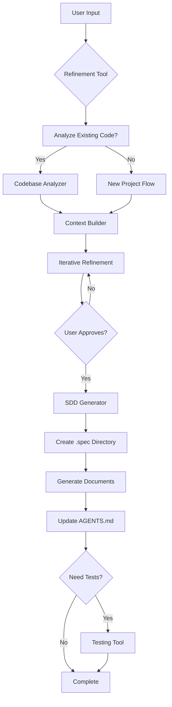

# KAT-PLANNER Design Document

## System Architecture

### Technology Stack
- **Language**: TypeScript/JavaScript
- **Runtime**: Node.js (v18+)
- **MCP SDK**: @modelcontextprotocol/sdk
- **File System**: Node.js fs/fs.promises
- **Parser Libraries**: 
  - @babel/parser (JavaScript/TypeScript analysis)
  - python-ast (Python analysis)
  - yaml/json parsers for config files

### Component Architecture

```
kat-planner/
├── src/
│   ├── index.ts                 # MCP server entry point
│   ├── server.ts                 # MCP server implementation
│   ├── tools/
│   │   ├── refinement.ts        # Refinement tool logic
│   │   ├── sdd-generator.ts     # SDD generation tool
│   │   └── sdd-testing.ts       # Optional testing tool
│   ├── analyzers/
│   │   ├── codebase.ts          # Existing code analysis
│   │   ├── project-detector.ts  # Project type detection
│   │   └── tech-stack.ts        # Technology stack identification
│   ├── generators/
│   │   ├── agents.ts            # AGENTS.md generator
│   │   ├── requirements.ts      # requirements.md generator
│   │   ├── design.ts            # design.md generator
│   │   └── tasks.ts             # tasks.md generator
│   └── utils/
│       ├── file-ops.ts          # File system operations
│       ├── prompts.ts           # System prompts management
│       └── context.ts           # Context state management
```

## Tool Specifications

### 1. Refinement Tool
**System Prompt Structure**:
```typescript
interface RefinementPrompt {
  role: "product_manager" | "software_architect";
  context: "new_project" | "enhancement" | "bug_fix";
  analysisData?: CodebaseAnalysis;
  conversationHistory: Message[];
}
```

**State Management**:
- Maintain conversation context across multiple refinement rounds
- Store project metadata for subsequent tool calls
- Track refinement status (in_progress, ready_for_generation, approved)

### 2. SDD Generator Tool
**Document Generation Pipeline**:
1. Parse refined specification
2. Create/verify .spec directory
3. Generate documents in sequence:
   - AGENTS.md (always at root)
   - requirements.md
   - design.md
   - tasks.md
4. Update AGENTS.md with progress
5. Return file paths and summary

**Template System**:
Each document type has customizable templates with placeholders for:
- Project-specific content
- Technology-specific sections
- LLM-optimized formatting

### 3. Testing Tool (Optional)
**Test Generation Logic**:
- Parse requirements for testable criteria
- Identify critical user flows
- Generate test specifications matching project testing framework
- Include edge cases and error scenarios

## Data Flow



## UI/UX Design

### Interaction Flow
1. **Initial Contact**
   - User invokes kat-planner through natural language
   - Tool responds with project type detection

2. **Refinement Phase**
   - Conversational Q&A format
   - Progressive disclosure of requirements
   - Clear indication when ready to proceed

3. **Generation Phase**
   - Status updates for each document created
   - File path confirmations
   - Summary of generated content

4. **Review Phase**
   - Prompt to review generated files
   - Option to regenerate specific documents
   - Clear completion message

### Response Formatting
- Use markdown for structured responses
- Code blocks for file paths and examples
- Bullet points for lists and options
- Clear section headers for different phases

## Error Handling

### Common Scenarios
1. **Permission Errors**: Graceful handling of read/write permissions
2. **Existing Files**: Ask before overwriting, option to backup
3. **Large Codebases**: Implement chunking for analysis
4. **Invalid Project Structure**: Provide helpful error messages
5. **LLM Failures**: Retry logic with exponential backoff

### Recovery Strategies
- Checkpoint system for long operations
- Partial generation recovery
- Clear error messages with suggested actions
- Rollback capability for failed generations

## Security Considerations
- No execution of user code during analysis
- Sanitize file paths to prevent directory traversal
- Respect .gitignore and similar exclusion files
- No external network calls except to LLM provider
- Local-only operation, no data persistence beyond session

## Performance Optimizations
- Lazy loading of large files
- Parallel document generation where possible
- Caching of analyzed codebase structure
- Incremental updates to AGENTS.md
- Efficient prompt token usage
